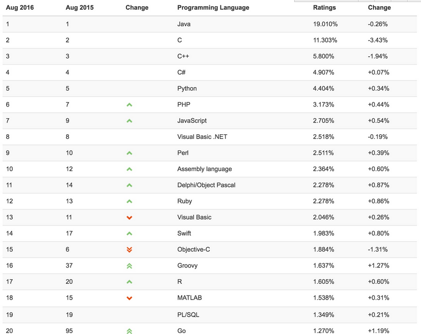
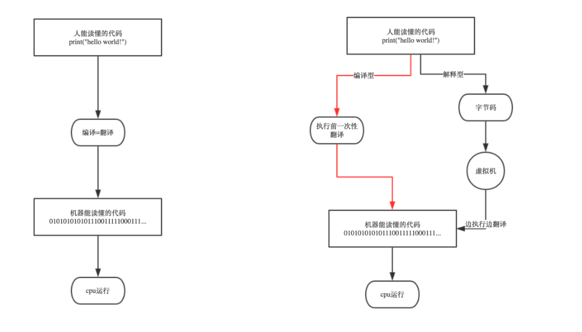
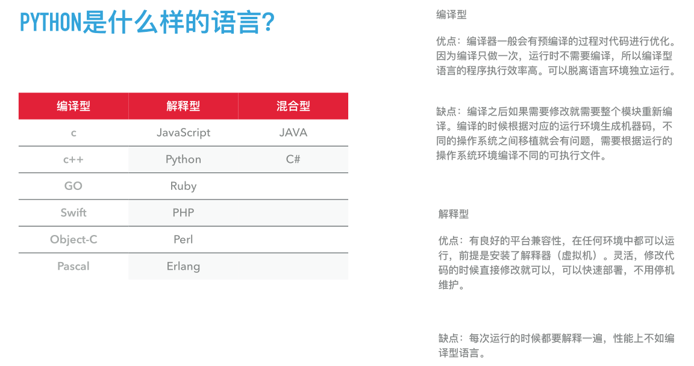
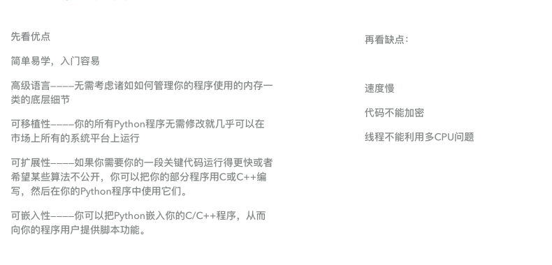
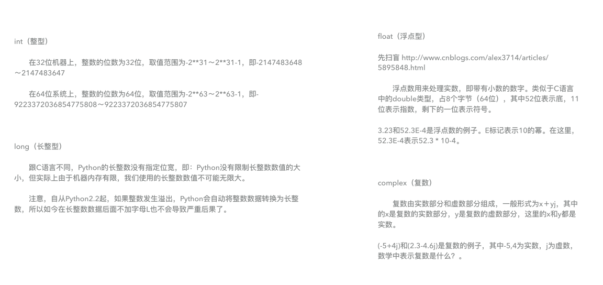
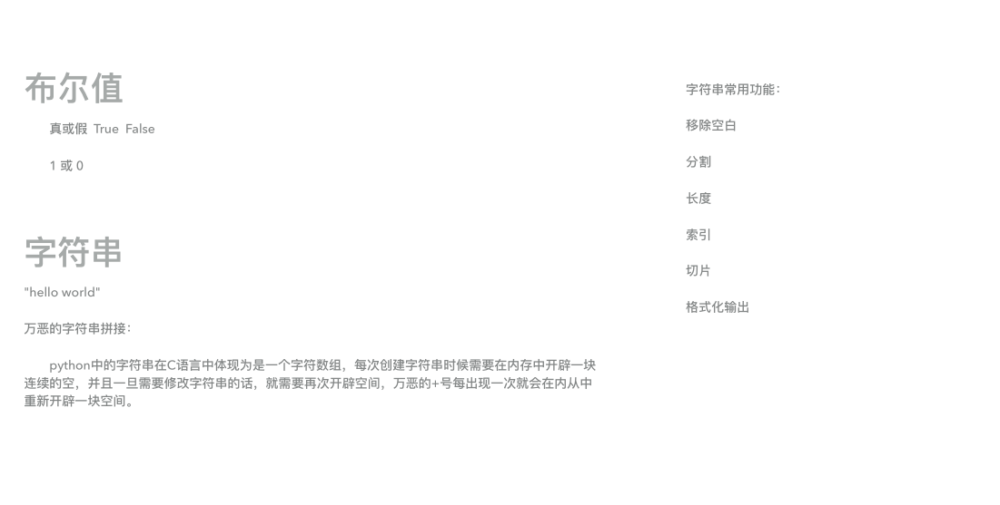
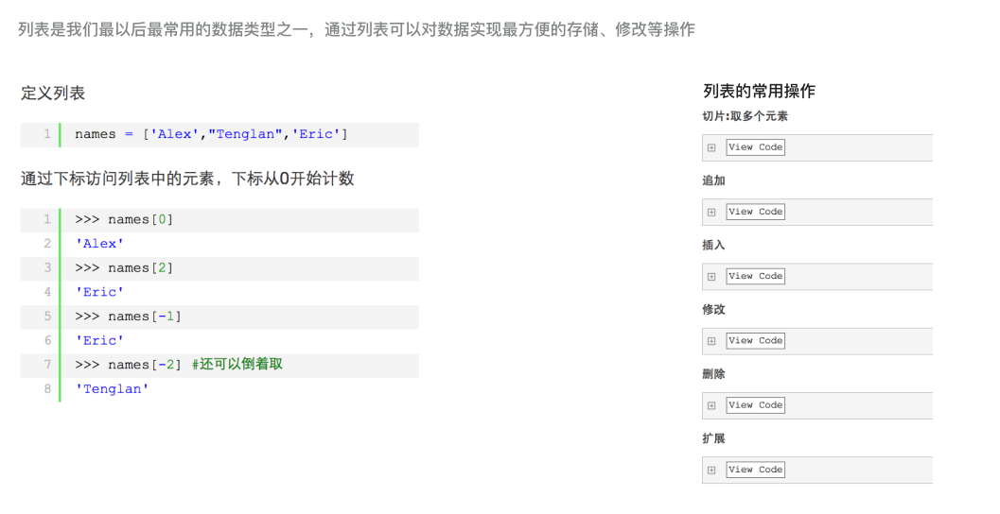
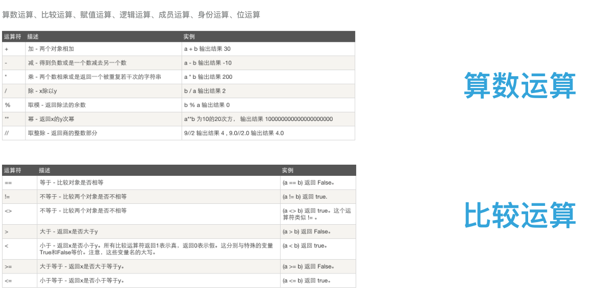
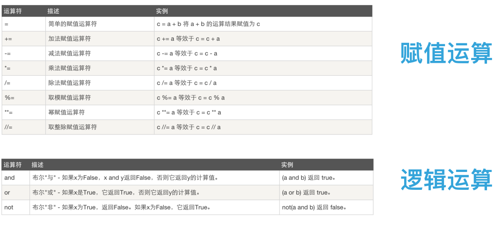
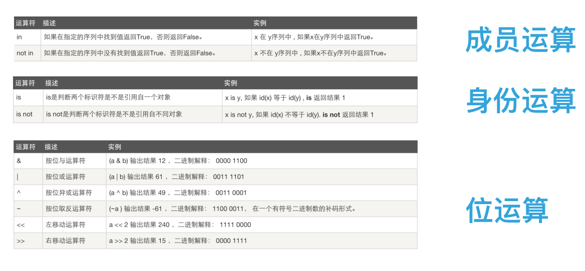

# 一 PYTHON 与其它语音的区别

* C\C++： 学习成本高,学习周期长，偏系统底层，在开发硬件驱动，嵌入式，游戏引擎开发等领域有广泛的应用
* JAVA：目前使用最广泛的编程语音，第一个跨平台的语音，在大型ERP软件开发\安卓APP开发\网站开发领域使用广泛 
* PYTHON:使用领域几乎和java一样广泛，但开发效率要高于java，在科学运算\数据分析\网站开发\爬虫开发\云计算\自动化运维\自动化测试等领域优势明显
* PHP:使用最广泛的WEB开发语言，非常适合中小型网站开发，学习成本低，开发效率高

### 1.2开发语言排名
  

### 1.3 Python在一些公司的应用 
* 谷歌：Google App Engine 、code.google.com 、Google earth 、谷歌爬虫、Google广告等项目都在大量使用Python开发
* CIA: 美国中情局网站就是用Python开发的
* NASA: 美国航天局(NASA)大量使用Python进行数据分析和运算
* YouTube:世界上最大的视频网站YouTube就是用Python开发的
* Dropbox:美国最大的在线云存储网站，全部用Python实现，每天网站处理10亿个文件的上传和下载
* Instagram:美国最大的图片分享社交网站，每天超过3千万张照片被分享，全部用python开发
* Facebook:大量的基础库均通过Python实现的
* Redhat: 世界上最流行的Linux发行版本中的yum包管理工具就是用python开发的
* 豆瓣: 公司几乎所有的业务均是通过Python开发的
* 知乎: 国内最大的问答社区，通过Python开发(国外Quora)
* 春雨医生：国内知名的在线医疗网站是用Python开发的
* 除上面之外，还有搜狐、金山、腾讯、盛大、网易、百度、阿里、淘宝 、土豆、新浪、果壳等公司都在使用Python完成各种各样的任务

### 1.4 PYTHON是一门什么样的语音

### 1.5 PYTHON是什么样的语言

### 1.6 PYTHON的优缺点

# 二 PYTHON的安装
###windowx
<pre>
1. 下载安装包 https://www.python.org/downloads/

2. 安装  默认安装路径： C:\python27

3. 配置环境变量 
4. 【右键计算机】--》【属性】--》【高级系统设置】--》【高级】--》【环境变量】--》【在第二个内容框中找到 变量名为Path 的一行，双击】 --> 【Python安装目录追加到变值值中，用 ； 分割】 
5. 如：原来的值;C:\python27，切记前面有分号
</pre>

### 2.1 第一个PYTHON程序
<pre>
# 在linux下创建一个文件叫hello.py，并输入:
# print("Hello world!")
# python hello.py
# 指定解释器  #!/usr/bin/env python
</pre>

### 2.2 变量的赋值

* name = "genglei"
* name2 = name
* print(name,name2)

### 2.3 变量定义的规则 
* 变量名只能是 字母、数字或下划线的任意组合
* 变量名的第一个字符不能是数字
* 以下关键字不能声明为变量名
<pre>
'and', 'as', 'assert', 'break', 'class', 'continue', 'def', 'del', 'elif', 'else', 'except', 'exec', 'finally', 'for', 'from', 'global', 'if', 'import', 'in', 'is', 'lambda', 'not', 'or', 'pass', 'print', 'raise', 'return', 'try', 'while', 'with', 'yield'
</pre> 
### 2.4 数据类型-数字

### 2.5 数据类型-布尔&字符串

## 2.5.1 异除空白
<pre>
>>> name = " genglei   "
>>> name.strip()
'genglei'
>>> name
' genglei   '
>>>
</pre>
### 2.5.2 长度
<pre>
>>> name
'alex jack rain'
>>> len(name)
14
</pre>
### 2.5.3 索引
<pre>
genglei
0123456
</pre>
### 2.5.4 切片 顾头不顾尾
<pre>
>>> name
'alex li'
>>> name[0:4]
'alex'
</pre>

### 2.5.5 拼接
<pre>
>>> msg = "my name is " + name + "and i am" + "old"
>>> msg
'my name is alex liand i amold'
>>> name
'alex li'
</pre>
### 2.5.6 格式化输出 占位符 $s
<pre>
>>> msg = "my name is name and i am age years old"
>>> msg
'my name is name and i am age years old'
>>>
>>> msg = "my name is %s and i am %s years old" %(name,age)
>>> msg
'my name is alex li and i am 23 years old'
</pre>

### 三 数据类型-列表 字符串不可以修改

<pre>
names = [] 声明列表
>>> names = ["genglei","tanyue"]
>>> names[1]
'tanyue'
>>> names[1] = "yueyue" #直接重新修改值
>>> names
['genglei', 'yueyue']
</pre>

### 3.1 列表添加内容，append 默认最后一位
<pre>
>>> names.append("SunGaohui")
>>> names
>['genglei', 'yueyue', 'SunGaohui']
</pre>

### 3.1 指定位置插入列表数据
<pre>
>>>names
['genglei', 'yueyue', 'SunGaohui']
>>>
>>> names.insert(1,"hello")
>>> names
['genglei', 'hello', 'yueyue', 'SunGaohui']
>>>
</pre>
### 3.2 删除列表数据
<pre>
>>> names
['genglei', 'hello', 'SunGaohui', 'lele', 'hehe']
>>> del names[1]
-------------------
>>> names
['genglei', 'SunGaohui', 'lele', 'hehe']
>>> names.remove("lele")
>>> names
['genglei', 'SunGaohui', 'hehe']
</pre>

### 3.3 查找索引并删除
<pre>
['genglei', 'SunGaohui', 'hehe']
>>> names.index("hehe")
2
>>> names[2]
'hehe'
>>> names[2] = "gl"
>>> names
>['genglei', 'SunGaohui', 'gl']
以上删除命令可以合成一条:如下
['genglei', 'SunGaohui', 'GL']
>>> names[names.index("GL")] = "gl"
>>> names
['genglei', 'SunGaohui', 'gl']
</pre>
### 3.4 查找列表重复内容
<pre>
>>> names
['genglei', 'lele', 'genglei', 'SunGaohui', 'gl', 'mack']
>>> names.count("genglei")
2
</pre>
### 3.5 排序
<pre>
# sort() reverse()倒序
# 排序是按照asil来排练，数字不可以排序，特殊字符，数字，大写 小写
>>> names
['genglei', 'lele', 'genglei', 'acli', 'SunGaohui', 'gl', 'mack', 'jack']
>>> names.sort()
>>> names
['SunGaohui', 'acli', 'genglei', 'genglei', 'gl', 'jack', 'lele', 'mack']
>>>
------------------------------------------------------------------------
#取列表的值3-5的内容
['mack', 'lele', 'jack', 'gl', 'genglei', 'genglei', 'acli', 'SunGaohui']
>>> names[3:6]
['gl', 'genglei', 'genglei']
------------------------------------------------------------------------
#去列表的值（倒取）
['mack', 'lele', 'jack', 'gl', 'genglei', 'genglei', 'acli', 'SunGaohui']
>>> names[-1]
'SunGaohui'
>>> names[-3:] #顾头不顾尾
['genglei', 'acli', 'SunGaohui']
-------------------------------------------------------------------------
</pre>
### 3.6 步长
<pre>
>>> names
['mack', 'lele', 'jack', 'gl', 'genglei', 'genglei', 'acli', 'SunGaohui']
>>> names[0:-1:2]
['mack', 'jack', 'genglei', 'acli']
</pre>
### 3.7 查看字符串类型
> type(8) 和is int 可以配合使用 ,查看8是不是整数 
>> type("stinde") is str 判断是不是整数 
>>>type([1,2,3,4]) is list 判断是否为列表
 
### 四 运算 

### 4.1 算数运算-比较运算 

### 4.2 赋值运算-逻辑运算

### 4.3 成员运算-身份运算

### 五 用户交互
<pre>
#! /usr/bin/env python
#_*_coding:utf-8_*_
name = input("what is your name?")
print("Hello" + name)
---------------------------
</pre>
### 5.1输入密码时，如果想要不可见，需要利用getpass模块中的getpass方法
<pre>
#! /usr/bin/env python
#_*_coding:utf-8_*
import getpass 
#将用户输入的内容赋值给name变量
pwd = getpass.getpass("请输入密码:")
print(pwd)
</pre>
### 5.2 用户登录
<pre>
#-*- coding:utf-8 -*-  
##################################################
#Filename: login.py                              #
#Revsion: 1.0                                    #
#Description login is test                       #
#Date: 2017/01/13                                #
#Auther: genglei                                 #
#Email: 18600517476@163.com                      #
##################################################

# 自己定义的用户名密码
import getpass #导入模块
_user = "genglei" 
_passwd = "abc123"
count = 0 #计数器 

while count <3:  #判断count是否大于3

    useradd = input("请输入用户名: ") #提示用户输入用户名名
    
    password = getpass.getpass("请输入密码: ")  #提示用户输入密码
    
    if useradd == _user and password == _passwd:  #判断用户输入的和自己定义的是否一致
        
        print ("欢迎登陆")
        break    #跳出循环
    
    else:
    
        print ("请检查用户名密码") #打印信息
        count += 1   #count=count+1 

</pre>

### 六 小结
> 变量的定义首字母大写为类
>> 变量的定义为数字不加双引号，加了双引号就是字符串
>>> 变量大写的定义为常量就是不可变的量
>>>> 单双引号没有任何区别,单行注释，不写内存
